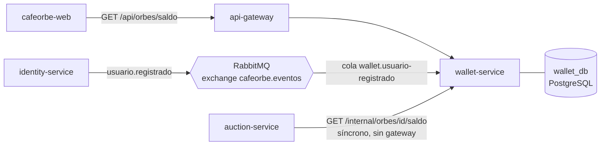
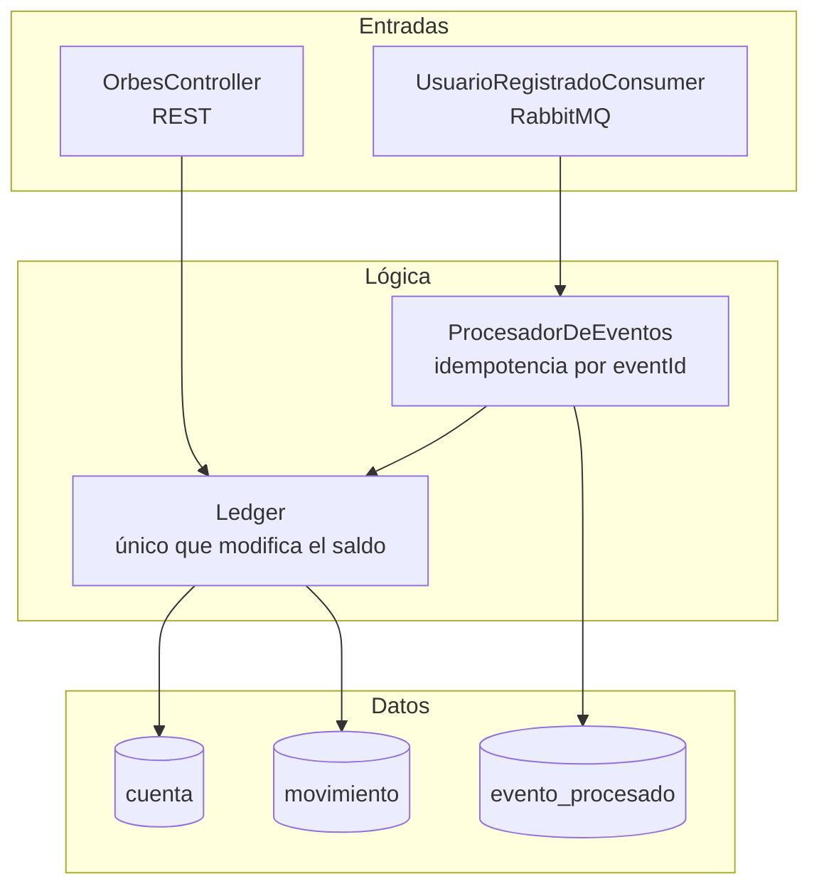
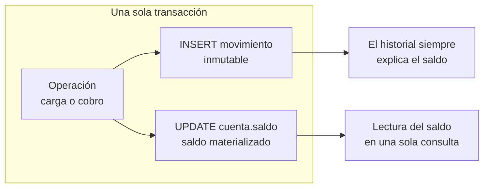
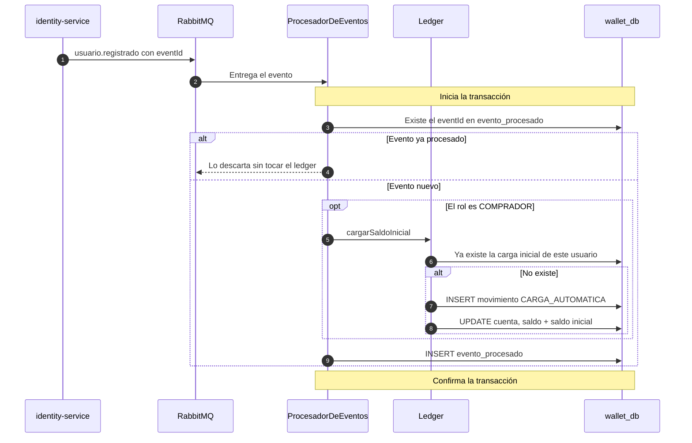
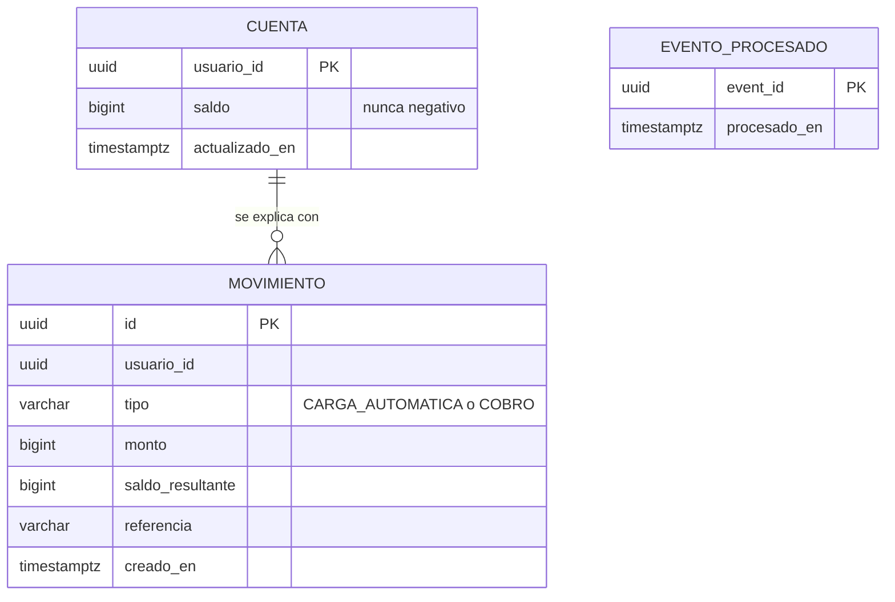
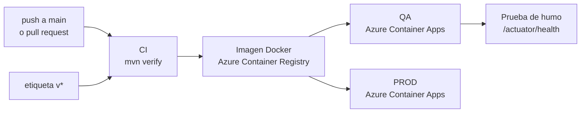

# cafeorbe-wallet-service

> Billetera de Orbes, la moneda virtual de CaféOrbe. Lleva el saldo de cada Comprador como un libro contable: el saldo nunca se edita, se deriva de movimientos inmutables.

| | |
|---|---|
| **Responsabilidad** | Saldo de Orbes, carga automática inicial y (Sprint 2) cobro al ganador |
| **Estilo interno** | Capas + patrón Ledger (libro de movimientos) |
| **Stack** | Java 21 · Spring Boot 3.5 · Spring Data JPA · Flyway · RabbitMQ |
| **Persistencia** | PostgreSQL, base propia `wallet_db` |
| **Puerto** | `8083` |
| **Historias** | HU-06, HU-07 y el apoyo a HU-14 |
| **Consume** | `usuario.registrado` |
| **Depende de** | Ningún otro servicio |

> En el MVP no hay dinero real ni recargas manuales. Este servicio reemplaza al antiguo `cafeorbe-payment-service`.

## Contenido

1. [Contexto](#1-contexto)
2. [Arquitectura interna](#2-arquitectura-interna)
3. [El patrón Ledger](#3-el-patrón-ledger)
4. [Contrato de la API](#4-contrato-de-la-api)
5. [Flujo: carga automática de Orbes](#5-flujo-carga-automática-de-orbes)
6. [Idempotencia](#6-idempotencia)
7. [Modelo de datos](#7-modelo-de-datos)
8. [Decisiones de arquitectura](#8-decisiones-de-arquitectura)
9. [Atributos de calidad](#9-atributos-de-calidad)
10. [Configuración](#10-configuración)
11. [Ejecución y pruebas](#11-ejecución-y-pruebas)
12. [Despliegue](#12-despliegue)
13. [Riesgos conocidos y evolución](#13-riesgos-conocidos-y-evolución)

---

## 1. Contexto



El servicio tiene tres entradas: el **Comprador** consulta su saldo por el gateway, **identity** avisa por evento que hay un usuario nuevo, y **auction** consulta el saldo de forma síncrona al validar una puja. Es la única llamada directa entre servicios de todo el sistema.

## 2. Arquitectura interna



| Capa | Paquete | Contenido |
|---|---|---|
| Entrada HTTP | `controller` | `OrbesController`, `ManejadorDeErrores` |
| Entrada por eventos | `consumer` | `UsuarioRegistradoConsumer` |
| Lógica | `service` | `Ledger`, `ProcesadorDeEventos` |
| Datos | `repository`, `model` | `Cuenta`, `Movimiento`, `EventoProcesado` |

**Regla estructural:** solo `Ledger` cambia el saldo. Ni el controlador ni el consumidor tocan la tabla `cuenta`.

## 3. El patrón Ledger

Un saldo que se sobrescribe no explica cómo se llegó a él y se descuadra con cualquier reintento. Aquí cada operación **inserta un movimiento inmutable** y actualiza el saldo materializado en la misma transacción.



| Movimiento | Monto | Referencia | Estado |
|---|:-:|---|---|
| `CARGA_AUTOMATICA` | positivo | `saldo-inicial` | Implementado (HU-07) |
| `COBRO` | negativo | id de la subasta | Previsto para el Sprint 2 (HU-20) |

**Invariantes**, protegidas en dos niveles:

- El saldo nunca es negativo: lo impide `Cuenta.aplicar` y, como última defensa, un `CHECK (saldo >= 0)` en la base de datos.
- Un mismo hecho se registra una sola vez por usuario: restricción única `(usuario_id, tipo, referencia)`.
- Los movimientos no se actualizan ni se borran: la entidad no tiene métodos de modificación y sus columnas son `updatable = false`.

## 4. Contrato de la API

| Método y ruta | Quién | Historia | Respuesta |
|---|---|---|---|
| `GET /api/orbes/saldo` | Usuario autenticado, por el gateway | HU-06 | `{ usuarioId, saldo }`. Un usuario sin cuenta ve `0` |
| `GET /api/orbes/movimientos` | Usuario autenticado, por el gateway | HU-06 | Últimos 50 movimientos, del más reciente al más antiguo |
| `GET /internal/orbes/{usuarioId}/saldo` | auction-service | HU-14 | `{ usuarioId, saldo }` |

Las rutas `/api/**` identifican al usuario por la cabecera `X-User-Id` que inyecta el gateway; sin ella responden `401`. La ruta `/internal/**` **no se expone por el gateway**: solo es alcanzable dentro de la red interna.

## 5. Flujo: carga automática de Orbes



Un Subastador no recibe Orbes: su evento se marca como procesado y nada más. El saldo inicial es configurable (`WALLET_SALDO_INICIAL`, 1000 por defecto).

## 6. Idempotencia

El broker entrega **al menos una vez**, y identity puede reenviar el evento de un mismo usuario. El servicio se protege en tres niveles, de modo que ninguna combinación de repeticiones produzca una doble carga:

| Nivel | Protege contra | Mecanismo |
|:-:|---|---|
| 1 | El mismo mensaje entregado dos veces | El `eventId` se guarda en `evento_procesado` en la misma transacción que su efecto |
| 2 | Un evento distinto del mismo usuario (reintento de identity) | `Ledger` comprueba si ya existe la carga inicial antes de aplicarla |
| 3 | Dos eventos del mismo usuario procesados a la vez | Restricción única `(usuario_id, tipo, referencia)`: el segundo falla, se reintenta y cae en el nivel 2 |

**Mensajes que fallan:** se reintentan 5 veces con espera creciente (1 s, 2 s, 4 s, 8 s). Si siguen fallando se descartan; en el MVP no hay cola de mensajes muertos.

## 7. Modelo de datos



`usuario_id` es el id que emite identity-service, pero **no hay clave foránea entre servicios**: cada servicio tiene su propia base y ninguno lee la de otro. El esquema lo gestiona Flyway; Hibernate solo valida.

## 8. Decisiones de arquitectura

| Decisión | Motivo | Costo aceptado |
|---|---|---|
| Ledger en lugar de un saldo editable | Auditoría completa y operaciones repetibles sin descuadre: es el estándar para manejar valor | Una tabla más y dos escrituras por operación |
| Saldo materializado además de los movimientos | Leer el saldo es una consulta por clave primaria, sin sumar el historial | Hay que mantener ambos en la misma transacción |
| Montos enteros (`bigint`) | Los Orbes no tienen decimales: se evita cualquier error de redondeo | No admite fracciones si el negocio cambia |
| Carga inicial por evento, no por llamada síncrona | identity no depende de que wallet esté arriba para dejar entrar al usuario | El saldo aparece un instante después del ingreso (consistencia eventual) |
| Consulta de saldo síncrona para auction | La validación de la puja necesita el saldo actual, no una copia que pueda estar atrasada | wallet es una dependencia en tiempo de ejecución de cada puja |
| Sin reserva de Orbes al pujar | Así lo definen HU-14 y HU-20 | Dos subastas ganadas a la vez podrían superar el saldo |

## 9. Atributos de calidad

| Atributo | Cómo se logra |
|---|---|
| **Integridad** | Invariantes en código y en base de datos; movimientos inmutables |
| **Idempotencia** | Tres niveles de protección contra eventos repetidos |
| **Auditabilidad** | Cada cambio de saldo tiene un movimiento con tipo, monto, saldo resultante, referencia y fecha |
| **Rendimiento** | El saldo se lee por clave primaria; auction le impone un timeout de 2 s |
| **Aislamiento** | La ruta interna no pasa por el gateway |

## 10. Configuración

| Variable | Por defecto | Uso |
|---|---|---|
| `DB_URL` `DB_USER` `DB_PASSWORD` | `jdbc:postgresql://localhost:5432/wallet_db` | Base de datos propia |
| `RABBIT_HOST` `RABBIT_PORT` `RABBIT_USER` `RABBIT_PASSWORD` | `localhost:5672` | Broker de eventos |
| `RABBIT_VHOST` `RABBIT_SSL` | `/` · `false` | Broker gestionado con TLS |
| `WALLET_SALDO_INICIAL` | `1000` | Orbes que recibe un Comprador en su primer ingreso |

## 11. Ejecución y pruebas

Requiere **Java 21** y el módulo `cafeorbe-contracts` instalado (`mvn install` en ese repositorio).

```bash
mvn spring-boot:run      # necesita Postgres y RabbitMQ: ver cafeorbe-infra
mvn test                 # 6 pruebas con H2 en memoria: no necesita infraestructura
```

Las pruebas (`WalletTest`) cubren la carga en el primer ingreso, la no duplicidad con el mismo evento y con un evento nuevo del mismo usuario, que un Subastador no recibe Orbes, y la consulta de saldo con y sin sesión.

## 12. Despliegue



El pipeline (`.github/workflows/ci.yml`) despliega en QA con cada cambio en `main` y en PROD con una etiqueta `v*`.

## 13. Riesgos conocidos y evolución

| Riesgo o deuda | Impacto | Acción propuesta |
|---|---|---|
| `/internal/orbes/{id}/saldo` no exige identidad | Si el servicio es accesible desde fuera, cualquiera puede leer el saldo de cualquier usuario | En el ambiente actual (express) el ingress interno no tiene efecto. Hace falta un secreto compartido entre el gateway y los servicios, o un ambiente con red propia |
| Sin cola de mensajes muertos | Un evento que falla 5 veces se pierde y ese Comprador queda sin Orbes | Cola de mensajes muertos con alerta |
| Sin reserva de saldo | Sobregiro posible con dos subastas ganadas a la vez; el `CHECK` haría fallar el segundo cobro | Reserva al pujar y liberación al ser superado, si el negocio lo requiere |
| `evento_procesado` no se purga | La tabla crece indefinidamente | Limpieza periódica de registros antiguos |
| QA y PROD comparten base de datos y broker en el pipeline | Saldos mezclados entre ambientes | Separar bases y vhost por ambiente |

**Sprint 2:** consumir `subasta.cerrada` y registrar el movimiento `COBRO` de forma transaccional e idempotente (un solo cobro por subasta, HU-20), y publicar `orbes.cobrados` para refrescar el saldo en pantalla.
